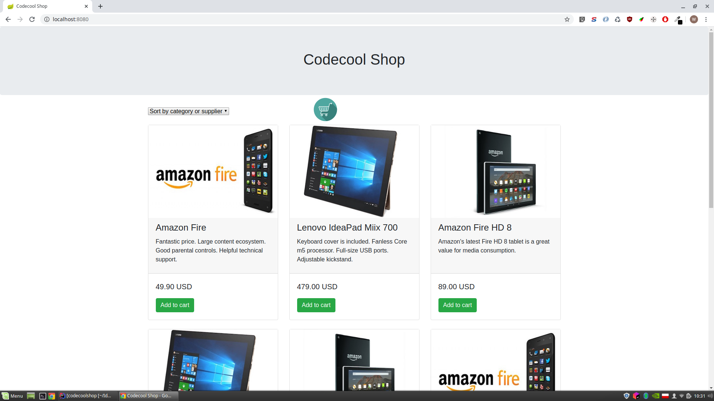
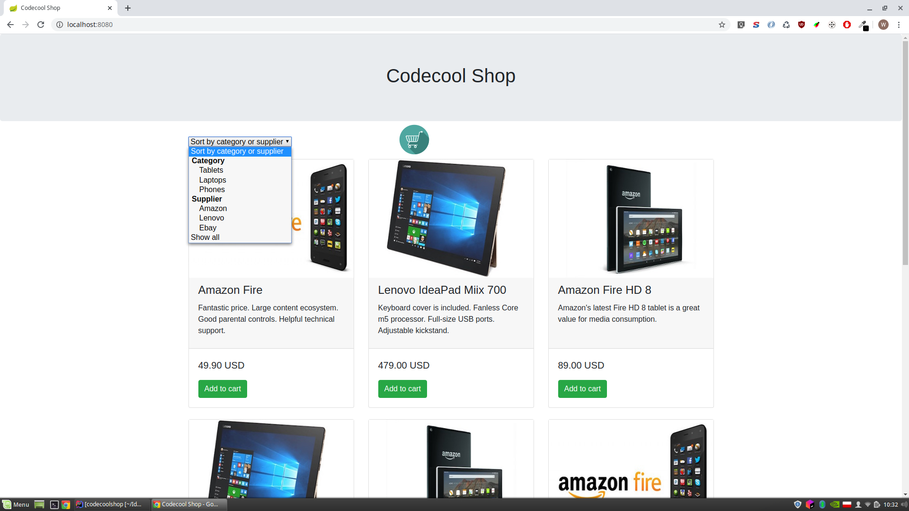
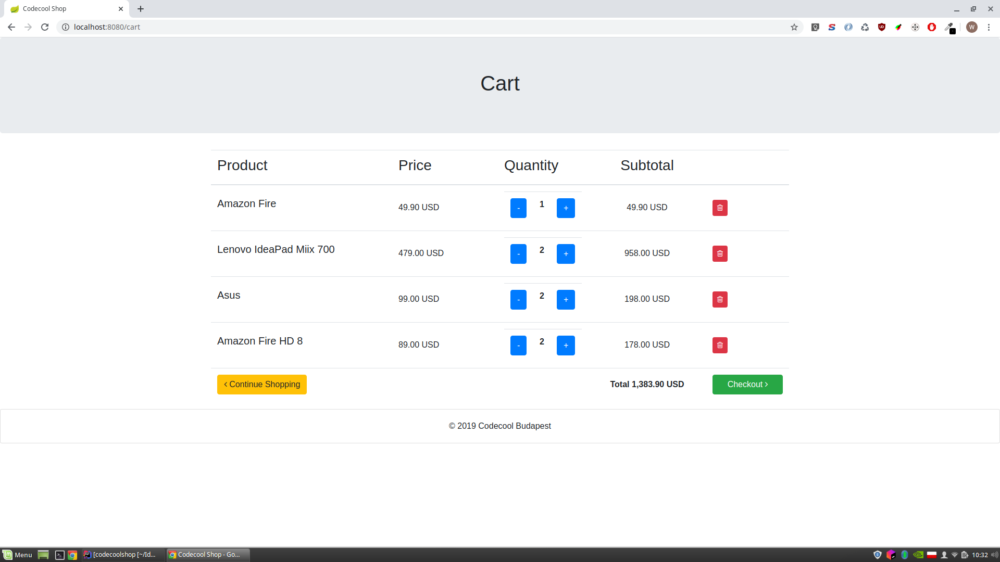
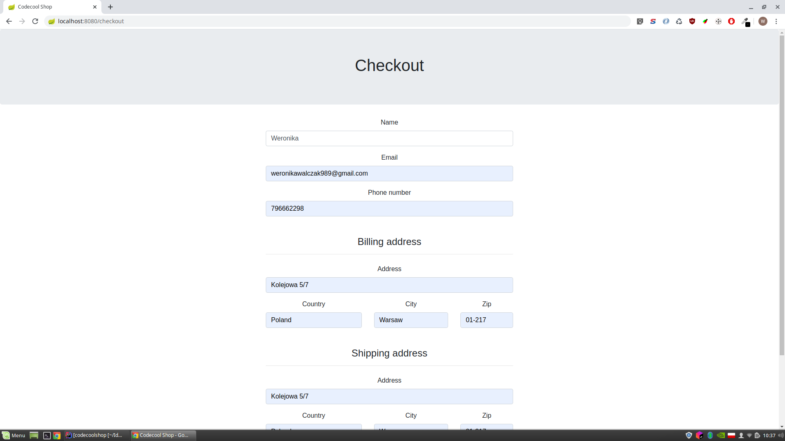
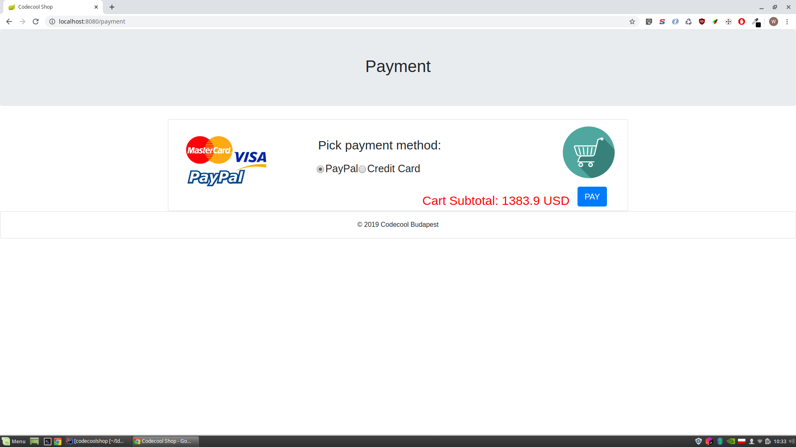
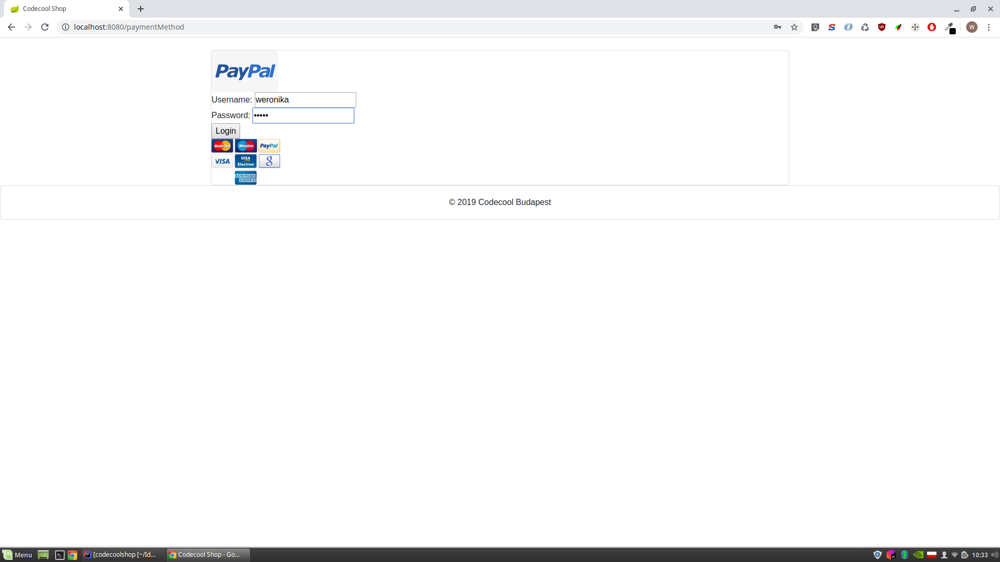
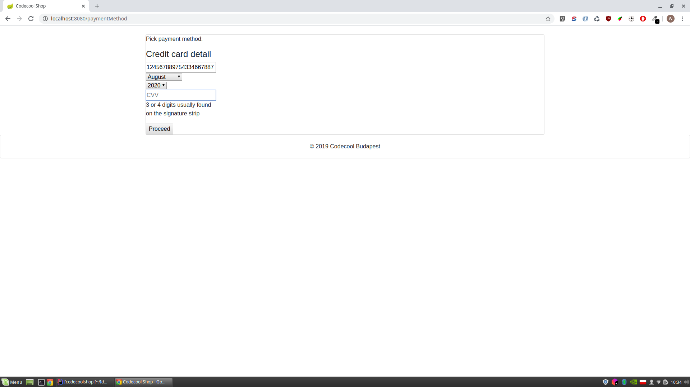

# Webshop - Online shop
An online eCommerce web-application written in Java, where users can browse products, add them into a shopping cart, proceed to checkout and perform mocked payments. 

## Table of contents
* [General info](#general-info)
* [Technologies](#technologies)
* [Setup](#setup)
* [Screenshots](#screenshots)
* [Status](#status)
* [Contact](#contact)

## General info
Webshop:
* Shows the main page with all kinds off products
* Gives the possibility to filter products by product category and supplier
* Displays cart with products
* Mocks the process of confirmation, checkout and payment

## Technologies
* Java Servlets
* Thymeleaf
* HTML, CSS, Bootstrap

## Setup
1. Download this project
2. Build with Maven
3. Deploy built war file on server like Tomcat or similar 

## Screenshots

## Status
Project is finished.

## Contact
Created by [Weronika Walczak](mailto:weronikawalczak989@gmail.com) - feel free to contact me!
